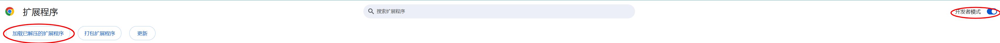
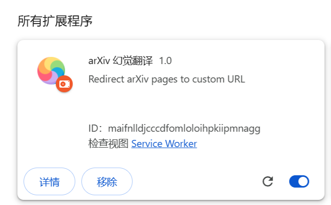

# 幻觉翻译浏览器插件


](LICENSE)

一键将 arXiv PDF/abs 页面重定向到[幻觉翻译](https://hjfy.top/)

## 功能特性
- 自动识别 arXiv 页面（`abs` 和 `pdf` 路径）
- 新标签页智能定位到当前标签右侧
- Manifest V3 规范开发

## 安装方法
打开[谷歌浏览器扩展程序](chrome://extensions/)，其他浏览器类似，打开开发者模式



下载本仓库，选择加载已解压拓展程序，选择本文件夹加载进去即可，加载成功后如下图所示



## 使用示例
```javascript
// 原始网址
https://arxiv.org/abs/2410.07087

// 转换后网址
https://hjfy.top/arxiv/2410.07087
```

## 贡献指南
1. Fork 本仓库
2. 创建特性分支 (`git checkout -b feature/新功能`)
3. 提交更改 (`git commit -am '添加新功能'`)
4. 推送分支 (`git push origin feature/新功能`)
5. 发起 Pull Request

## 许可证
MIT © [Tongpeng Guan](https://github.com/guantongpeng/arxiv-hjfy-extension)

